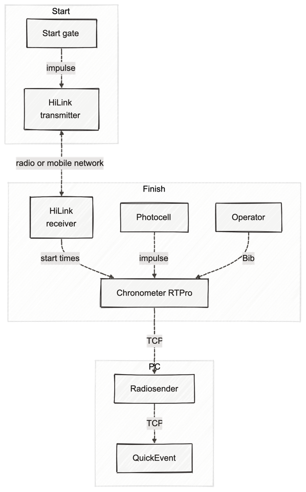
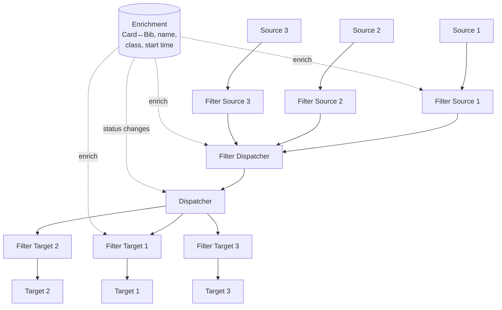
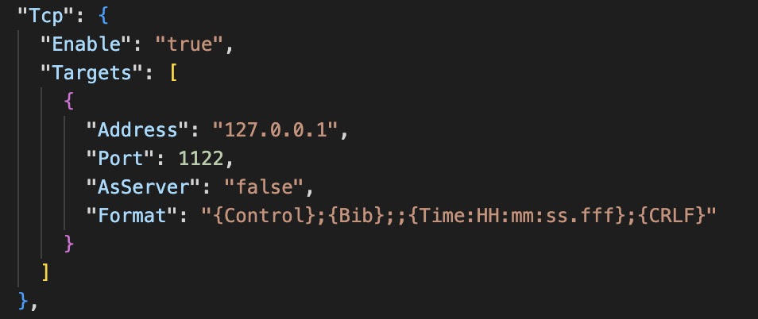
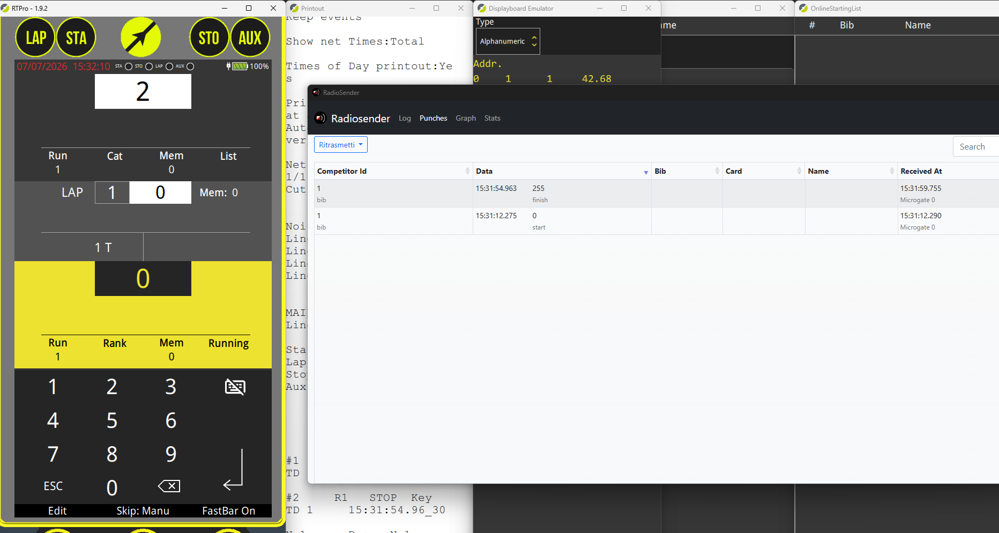
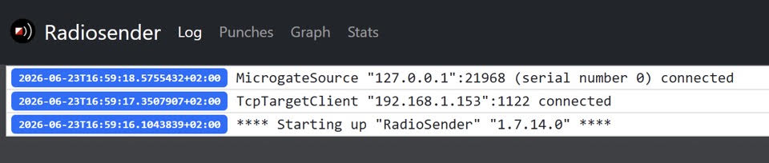
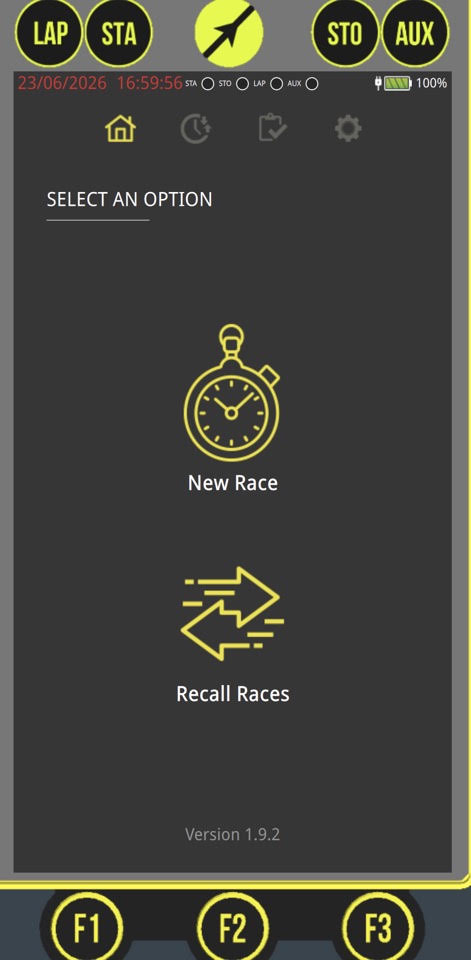
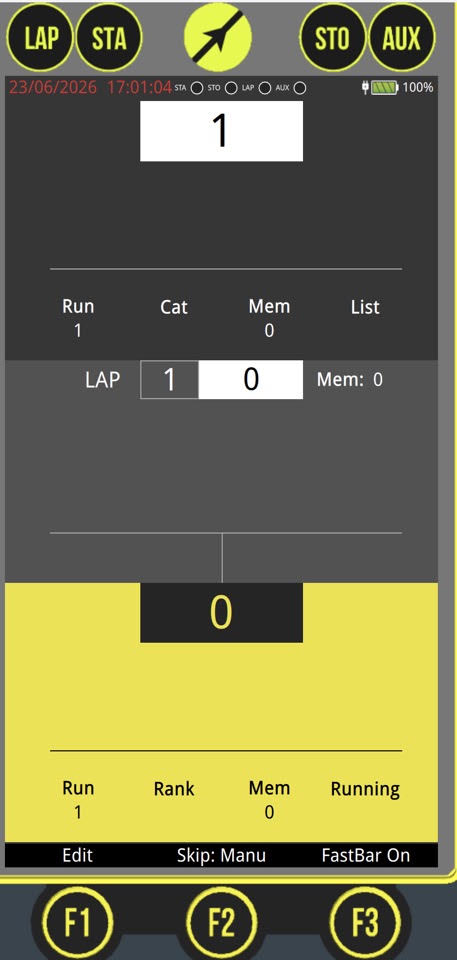
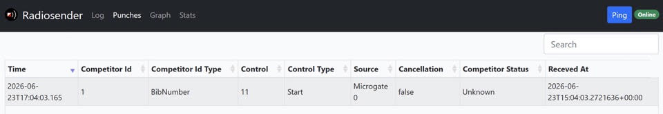
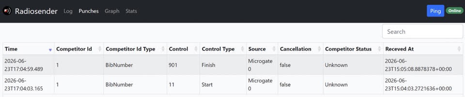
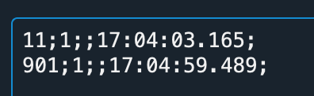

# RadioSender

RadioSender is a portable application that acts as a **decoder and router for live timing data**.
It reads punches (start / lap / finish times) from one or more _sources_, optionally transforms and
enriches them, and forwards them to one or more _targets_ — an event-management or results system
(Oribos, QuickEvent, SportSoftware, OResults, …), a TV graphics system, a live-results service, or
just a plain TCP listener.

Its main purpose is to hide the complexity of each device's native protocol: instead of
implementing those protocols yourself, you let RadioSender talk to the hardware and you receive
clean, simple records in a format you choose.

It runs on Windows, Linux and macOS (the printer target is Windows-only).

**Sources it can read from:** Microgate chronometer (REI2 protocol), Microplus, SportIdent Center,
SportIdent serial station, TmF radio gateway, ROC, SIRAP, MQTT, OBR, generic TCP.

**Targets it can write to:** its own web UI, generic TCP, HTTP, file, receipt printer, SIRAP,
OResults, Oribos.

- Repository: <https://github.com/EdoardoTona/RadioSender>
- Releases (download): <https://github.com/EdoardoTona/RadioSender/releases>

---

## 1. Where RadioSender sits in the chain

This is the layout used for a start-gate + photocell setup at an orienteering event:



_The diagram names QuickEvent as the target, but that box stands for whatever event-management
software you use — Oribos, QuickEvent, SportSoftware, OResults and others all work the same way
from RadioSender's point of view._

Reading the diagram from the top:

| Stage      | What happens                                                                                                                                                                                                         |
| ---------- | -------------------------------------------------------------------------------------------------------------------------------------------------------------------------------------------------------------------- |
| **Start**  | The start gate produces an impulse. A **HiLink transmitter** picks it up and sends it onward, either by radio or over a mobile network / Wi-Fi (using the [HiChrono companion app](https://hichrono.microgate.it/)). |
| **Finish** | The **HiLink receiver** delivers the start times, the **photocell** delivers the finish impulse, and the **operator** assigns the bib number. All three feed the **RTPro chronometer**.                              |
| **PC**     | The chronometer is connected to the PC by serial cable or TCP. **RadioSender** decodes its protocol and forwards the data by TCP to the **event-management software** (or any other target).                         |

Only start and finish times travel this path. Radio controls, live results, TV graphics and
commentator feeds are handled downstream by the event-management / results platform.

> The chronometer's native protocol is documented in the
> [REI2 transmission protocol](https://timing.microgate.it/sites/default/files/manuals/REI2-Transmission_Protocol_1095_002_E.pdf),
> and the chronometer itself in the
> [RTPro user manual](https://timing.microgate.it/sites/default/files/manuali/RTPro/RTProUserManual_EN.pdf).
> You should not need either of them if you use RadioSender as the decoder.

---

## 2. How data flows inside RadioSender

Every punch travels **source → dispatcher → targets**, and a **filter** can be applied at each of
those three points. Filters are named and defined once, then referenced by name wherever you want
them applied.



Two consequences worth knowing:

- **The dispatcher deduplicates.** A punch that arrives twice from the _same_ source (a poll
  repeat, a reconnect, a manual re-send) is forwarded only once. The identity includes the source,
  so the _same_ punch arriving from _two different_ sources is **not** deduplicated — that is
  intentional, but plan for it if you run redundant sources.
- **A filter only runs where it is referenced.** Defining a filter is not enough: point at it from
  `Dispatcher.Filter`, or from a specific source's / target's `Filter` property. A filter placed on
  a source affects only that source; on the dispatcher it affects everything.

---

## 3. Install

RadioSender is **portable** — there is no installer.

1. Download the latest release from
   <https://github.com/EdoardoTona/RadioSender/releases> and unzip it into a folder.
2. Run it once. If there is no `appsettings.json` next to the executable, RadioSender **writes a
   default one** — edit that file rather than writing one from scratch.

To follow this tutorial without real hardware, also download and install the RTPro chronometer
simulator: [RTPro Simulator v. 1.9.2](https://update.microgate.it/RTpro/RTProSimulator.exe).

---

## 4. Configure `appsettings.json`

The file has four sections that matter: **`Source`**, **`Enrichment`**, **`Target`** and
**`Filters`** (plus `Dispatcher`, which just names the filter applied to everything).

Each source and target block has its own `Enable` flag, so you can leave the whole default file in
place and switch on only what you need.

### Source

For this walkthrough the source is the RTPro simulator, reachable on **TCP localhost port 21968** —
the same block is used for a real chronometer over TCP:

```json
"Source": {
  "Microgate": {
    "Enable": "true",
    "Sources": [
      {
        "Address": "127.0.0.1",
        "Port": 21968
      }
    ]
  }
}
```

### Target

The example below sends every punch to a TCP endpoint on port `1122`, using a one-line text
format:



```json
"Target": {
  "Tcp": {
    "Enable": "true",
    "Targets": [
      {
        "Address": "127.0.0.1",
        "Port": 1122,
        "AsServer": "false",
        "Format": "{Control};{Bib};;{Time:HH:mm:ss.fff};{CRLF}"
      }
    ]
  }
}
```

- `AsServer: false` — RadioSender **connects out** to `Address:Port`. Set it to `true` to have
  RadioSender **listen** on `Port` instead and let the other system connect in.
- Change `Address` and `Port` to match the system that will consume the data (e.g. the port your
  event-management software listens on).

### Control mapping (important)

The chronometer emits **control `0` for start** and **control `255` for finish** — those are the
raw values you will see if no mapping is in place:



Most results systems expect different numbers (for orienteering, typically `11` for start and
`901` for finish). Map them inside a filter:

```json
"Dispatcher": {
  "Filter": "Default"
},
"Filters": {
  "List": [
    {
      "Name": "Default",
      "Enable": true,
      "MapControls": {
        "255": 901,
        "0": 11
      }
    }
  ]
}
```

You can map to any numbers you like, with two caveats:

- **Mapping a control to `0` excludes it** — that is the documented way to drop a control you do
  not want forwarded. So `0` is not usable as a _destination_ number.
- **Renumbering does not change the punch type.** With the Microgate source, start/finish is
  already decided by the chronometer's logical channel (`0` = start, `255`/`65535` = finish), which
  is why the screenshots below show control `11` still typed as _Start_. The `TypeFromCode` section
  of a filter is for sources that do **not** report a type — it derives Start / Finish / Check /
  Clear from the control number.

### Other useful filter keys

| Key                                                | What it does                                                                                                                                    |
| -------------------------------------------------- | ----------------------------------------------------------------------------------------------------------------------------------------------- |
| `MapCompetitorIds`                                 | Renumber a bib or remap a card (map to an empty string to drop that competitor). Typical use: a competitor gets a replacement SI card mid-race. |
| `IncludeOnlyControls` / `IncludeOnlyCompetitorIds` | Whitelists. Empty means "everything".                                                                                                           |
| `IgnoreOlderThan`                                  | Drops punches older than the given `d:hh:mm:ss`. Useful so a stale device does not dump yesterday's data into a live event.                     |
| `OverrideCompetitorIdType`                         | Force the id to be treated as `BibNumber` or `PunchingCard`.                                                                                    |
| `Enrichers`                                        | Names of the enrichment sources to apply — see section 8.                                                                                       |

---

## 5. Run it

Open the **RTPro simulator first**, then open **RadioSender**.

RadioSender's `Log` tab confirms both ends of the chain are up — the Microgate source is
connected and the TCP target is connected:



In the simulator, choose **New Race**, then **Single Starts** and **Alpine Ski**, give it a name
and save. Then click **Timing**.



The timing screen is divided into three parts — **Start**, **Lap**, **Finish**. Bib number 1 is
ready to start:



### Fire a start

Click **STA**. This is the equivalent of the start gate opening. On RadioSender's **Punches** tab
the punch appears: bib `1`, control `11` (start).



### Fire a finish

Click **STO**, then press **enter** to confirm the bib number. A second punch appears: bib `1`,
control `901` (finish).



### Check what was actually sent

If your event-management software (or your own system) is connected, the start and finish times
should have arrived there. To verify the raw output you can use any TCP listener — the example
below is PacketSender:

```
11;1;;17:04:03.165;
901;1;;17:04:59.489;
```



---

## 6. The user interface

The UI is a small web application. RadioSender opens it in its own window, and the **same pages
are reachable from any browser on the network** at `http://<host>:8082` (the port comes from the
`Urls` setting at the top of `appsettings.json`). That is handy for keeping an eye on the flow from
a second machine.

| Tab         | Contents                                                                                     |
| ----------- | -------------------------------------------------------------------------------------------- |
| **Log**     | Connection and error messages — the first place to look when nothing arrives.                |
| **Punches** | Every punch received, with the resolved control, type, source, cancellation flag and status. |
| **Graph**   | Nodes and hops, with latency and signal strength where the source reports them.              |
| **Stats**   | Counters per source / control.                                                               |

### Replay — read this before the event

A TCP target that is **disconnected silently drops** whatever arrives during the outage; the
connection comes back by itself, but the missed punches do not. The **Punches** tab therefore has a
**Replay** control: re-send a single punch with the button on its row, or use the dropdown to
re-send the **last 10 / 25 / 50 / 100 / All** punches.

This is what you use after restarting the results software, or after a cable or Wi-Fi drop. (In the
screenshot in section 4 the button appears with an older Italian label, _Ritrasmetti_.)

---

## 7. The output format

Format strings are used by the TCP, HTTP, file and printer targets. The one above,
`{Control};{Bib};;{Time:HH:mm:ss.fff};{CRLF}`, produces `<control>;<bib>;;<time>;`.

### Available placeholders

| Group           | Placeholders                                                                                        |
| --------------- | --------------------------------------------------------------------------------------------------- |
| Identity        | `{CompetitorId}` (the id whatever its type), `{Bib}`, `{Card}`, `{Card2}`, `{CompetitorIdType}`     |
| From enrichment | `{Name}`, `{Class}`, `{Nation}`, `{Club}` / `{ClubName}`, `{ClubId}`, `{ClubNation}`, `{StartTime}` |
| Punch           | `{Control}`, `{ControlType}`, `{Type}` (short: `STA`/`FIN`/`CN`/`CHK`/`CLR`), `{Source}`            |
| Time            | `{Time}`, `{ReceivedAt}`, `{UnixS}`, `{UnixMs}`, `{NetTime}`                                        |
| Flags           | `{Cancellation}`, `{Status}`                                                                        |
| Line endings    | `{CRLF}`, `{CR}`, `{LF}`                                                                            |

Times accept a .NET format specifier after a colon, e.g. `{Time:HH:mm:ss.fff}`,
`{Time:HH:mm:ss,fff}` or `{Time:yyyy-MM-ddTHH:mm:ss.fffzzz}`.

### Things to get right

- **Times are always time of day** (wall-clock, absolute), e.g. `16:39:10.123` — never net time.
  Any consumer that needs net time must hold the start list and compute the difference itself.
  This applies to the feed sent to TV production too: agree it with them in advance, since some
  graphics operators expect net time.
- **`{Bib}` and `{Card}` are only filled when known.** A source reports one identifier — the
  Microgate chronometer reports a **bib**, a SportIdent station reports a **card**. The placeholder
  for the other one comes out **empty** unless an enrichment source can resolve it. So keep both
  fields in your protocol and allow either to be empty.
- **Cancellations need `{Cancellation}` in the format.** RadioSender receives cancellations from
  the chronometer (when the operator fixes a wrong bib assignment) and renders them as `ANN`. But a
  receiver cannot tell a cancellation from a normal punch unless the format says so, so **a format
  without `{Cancellation}` drops cancellation events entirely** — including the example format
  above. Add the placeholder if the downstream system can act on it.
- **Status changes (DNS / DNF / MP / DSQ / OverTime) need `{Status}` or `{Time}`.** With `{Status}`
  in the format the status is sent as text. Without it, the status is encoded as a **sentinel time**
  — `00:00:01` = DNS, `:02` = DNF, `:03` = MP, `:04` = DSQ, `:05` = OverTime, `00:00:00` =
  waiting/running — and a format with neither placeholder drops these events.

If none of the built-in targets fits the system you are feeding, a new output protocol can be added
to RadioSender.

---

## 8. Start lists and enrichment

An **enrichment source** attaches competitor data to each punch — **card ↔ bib mapping**, name,
class, nation, club and scheduled start time — which is what makes `{Bib}` _and_ `{Card}` (and
`{Name}`, `{Class}`, …) available at the same time. Two are available: **Oribos** (live, over HTTP)
and **IOF XML**.

The IOF XML enricher watches a folder for an **IOF XML 3.0 StartList or EntryList** file, picks the
most recently written file matching the pattern, and **reloads automatically whenever the file
changes** — so you can drop in an updated start list during the event.

```json
"Enrichment": {
  "IofXml": {
    "Enable": "true",
    "Sources": [
      {
        "Name": "IofXml",
        "Directory": "C:\\startlists",
        "Pattern": "*.xml"
      }
    ]
  }
}
```

Then activate it on the filter that should use it:

```json
"Filters": {
  "List": [
    {
      "Name": "Default",
      "Enable": true,
      "Enrichers": [ "IofXml" ]
    }
  ]
}
```

Enrichers listed for a filter are applied **in order**, and a later one overwrites fields set by an
earlier one. Lookup is best-effort: a punch whose id is not in the start list passes through
unchanged.

> The `Enrichment:IofXml` block is not present in the default `appsettings.json` — add it with the
> keys above.

---

## 9. Reconfiguring while running

| Change                                                                       | Restart needed?                                                                                                                                 |
| ---------------------------------------------------------------------------- | ----------------------------------------------------------------------------------------------------------------------------------------------- |
| **Filters** (card/bib mapping, control mapping, enabling/disabling a filter) | No — hot-reloaded as soon as you save the file. Useful to add a card mapping when a competitor gets a replacement card, or to swap two sources. |
| **Start list / entry list file** (IOF XML enrichment)                        | No — reloaded when the file changes.                                                                                                            |
| **Sources and targets**                                                      | Yes — restart the app.                                                                                                                          |
| **Dropped connection**                                                       | No — reconnection is automatic (retried every second). Punches that arrived during the outage are lost, though: use **Replay** to re-send them. |

Because sources cannot be changed at runtime, the practical approach for an event is to **enable
every source you might need up front and filter out the data you don't want**.

---

## 10. Practical notes from real events

### Connectivity at the start

The start gate needs to get its impulse to the finish. For **short distances** (a few kilometres)
the start gate's built-in **HiLink radio transmitter** is enough. For the **longer distances
typical of orienteering**, use a network link instead:

- **Starlink** is easy and cheap to set up: a mini kit is around €299 plus about €45/month, which
  you can cancel after the event; kits can often be borrowed or rented. It needs power (generator
  or power station), it creates a Wi-Fi network, and it gives connectivity anywhere. Its one
  constraint is roughly **45° of clear sky view**, which can be hard in dense forest.
- **Piggyback on the TV production.** If TV has a multi-fibre cable to the start, ask for a direct
  Ethernet drop. Connectivity at the start is useful for communications anyway.

### Bib numbers at the start

At the start, bib handling is normally _not_ a manual problem: the system can be configured to
**auto-increment (or decrement)** the bib number. The operator only has to skip DNS runners, using
a simple physical button to step the number up or down. Manual bib entry is really only a concern
at the **photocell / finish**, though it can also be typed in at the start when two A-final starts
overlap.

### Latency and matching the video feed

Intermediate data and the video feed should reach the OB van **at the same time**, or punches will
appear too early or too late on screen. The risk comes from mixing transmission media with very
different latencies:

| Camera       | Data link                 | Result                         |
| ------------ | ------------------------- | ------------------------------ |
| Wired camera | GSM/LTE for intermediates | Bad — very different latencies |
| 4G camera    | LTE modem                 | Good — same medium technology  |
| 4G camera    | Direct radio              | Punches arrive too early       |

An orienteering-experienced graphics operator can deliberately delay the intermediate data to
compensate. If cameras in the forest are wired, ask the production whether you can run your data
over the same cables.

---

## 11. Reference

| Item                       | Link                                                                                                |
| -------------------------- | --------------------------------------------------------------------------------------------------- |
| RadioSender source         | <https://github.com/EdoardoTona/RadioSender>                                                        |
| RadioSender releases       | <https://github.com/EdoardoTona/RadioSender/releases>                                               |
| RTPro simulator v1.9.2     | <https://update.microgate.it/RTpro/RTProSimulator.exe>                                              |
| RTPro user manual          | <https://timing.microgate.it/sites/default/files/manuali/RTPro/RTProUserManual_EN.pdf>              |
| REI2 transmission protocol | <https://timing.microgate.it/sites/default/files/manuals/REI2-Transmission_Protocol_1095_002_E.pdf> |
| HiChrono companion app     | <https://hichrono.microgate.it/>                                                                    |
| OResults integration docs  | <https://docs.oresults.eu/integrations/for-developers>                                              |
