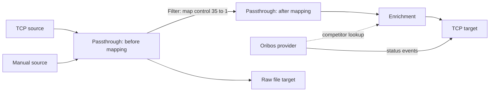

# Proposta: configurazione a nodi e modifica a runtime

Stato: proposta, senza modifiche al comportamento dell'applicazione. Analisi del codice al 6 settembre 2026, aggiornata con ispezione per nodo, filtri sugli edge e gestione dei documenti.

L'obiettivo è rendere configurabili dalla UI sorgenti, destinazioni, trasformazioni e collegamenti, applicando le modifiche senza riavviare RadioSender. Il documento JSON resta il formato portabile della configurazione. La modularità dei protocolli rimane il criterio principale del progetto.

## Decisioni consigliate

- Un modello di configurazione a grafo indipendente dalla libreria grafica.
- Un runtime C# che gestisce istanze, instradamento e cambi di configurazione.
- Grafo diretto senza cicli nella prima versione; diramazioni e confluenze supportate.
- Filtri e mapping opzionali sugli edge, valutati indipendentemente per ogni ramo.
- Ispezione degli ingressi e delle uscite di ogni nodo; replay da un'uscita precisa e passthrough per punti intermedi.
- Configurazioni tipizzate C# per ciascun modulo, con descrizione dei campi per la UI.
- Comandi e pannelli opzionali dichiarati dai moduli.
- Vue 3 + TypeScript + Vite + Vue Flow, mantenendo ASP.NET Core, SignalR e Photino.
- New, Open, Save, Save As e autosalvataggio del documento; Apply separato dal salvataggio.
- Implementazione per incrementi verificabili, iniziando da Manual source, TCP e File. Nessuna migrazione della configurazione precedente richiesta agli utenti.

Convenzione di progetto: codice, identificatori, esempi, commenti e stringhe di esempio sono in inglese. Il testo esplicativo di questa proposta rimane in italiano.

Il grafo non impone che gli oggetti source conoscano gli oggetti target. Un piccolo motore centrale può eseguire qualsiasi topologia: il limite attuale è l'inoltro fisso a tutti i target, non l'esistenza di un dispatcher.

## Cosa cambia rispetto al codice attuale

| Punto attuale | Conseguenza | Evoluzione |
| --- | --- | --- |
| `Program.cs` e `Configure*` registrano le istanze configurate nel contenitore DI all'avvio | Il numero delle istanze è fisso | Registrare i tipi di modulo e le factory; far gestire le istanze al runtime |
| `HostOrchestrator` acquisisce `IEnumerable<IRadioSenderHost>` | Avvio e arresto riguardano l'insieme iniziale | Un solo servizio ospitato gestisce il ciclo di vita dinamico |
| `DispatcherService` materializza `IEnumerable<ITarget>` | Le sorgenti inviano sempre allo stesso insieme di target | Instradamento per ID del nodo e porta di uscita |
| Le sorgenti dipendono direttamente da `DispatcherService` | Il punto d'ingresso non identifica necessariamente l'istanza di configurazione | Iniettare una piccola interfaccia di pubblicazione legata all'istanza |
| `FilterService` legge `IOptionsMonitor`, ma indicizza gli enrichment nel costruttore | Cambiano le regole, non le istanze degli enrichment | Trasformazioni e riferimenti risolti nella revisione attiva del grafo |
| Alcuni target aprono connessioni nel costruttore, ad esempio `TcpTargetClient` | Costruire una configurazione candidata ha già effetti esterni | Costruttori senza I/O; apertura in `StartAsync`, chiusura in `StopAsync` |
| `DeviceHub.Ping()` invoca un evento globale | Il comando non è indirizzato a una sorgente | Comandi per ID di istanza, con eventuale azione globale di aggregazione |
| `UIService` è anche un target di dati | Una sola tabella non rappresenta i valori differenti dei vari rami | Ispezione del runtime per nodo e porta, indipendente dai target |
| `ManualSender` contiene un proprio `Punch` e un client SIRAP | Il modello dati può divergere dal programma principale | Source manuale che usa il `Punch` principale e i normali collegamenti |

La pagina `Graph` esistente rappresenta nodi e collegamenti della rete radio (`NodeNew`, `Hop`). L'editor della configurazione sarà una pagina distinta, **Flows**; la visualizzazione attuale diventerà **Radio network**. La vista **Punches** diventa un inspector contestuale riutilizzabile, non un target configurabile.

## Modello del grafo

Un nodo ha `id` stabile, `type`, nome visualizzato, stato abilitato e `settings` specifici. L'identità non dipende da indirizzo, porta, nome visualizzato o posizione nell'array. Il `SourceId` contenuto in `Punch` continua a indicare la provenienza dei dati: è distinto dall'ID del nodo che li introduce nel grafo.

Le porte sono dichiarate dal tipo di modulo. Ogni edge ha un ID stabile, nodo e porta di partenza, nodo e porta di arrivo, stato abilitato e una proprietà `filter` opzionale. La configurazione non può inventare porte non supportate dal modulo. Un edge senza filtro inoltra invariato il dato.

| Tipo di nodo | Ingressi | Uscite | Responsabilità |
| --- | --- | --- | --- |
| Source | Nessuno | Uno o più flussi | Ricevere o generare eventi |
| Enrichment | Flusso | Flusso | Arricchire mediante un provider condiviso |
| Passthrough | Flusso | Flusso | Inoltrare invariato; punto nominabile di ispezione, replay e diramazione |
| Deduplicate | Flusso | Flusso | Eliminare duplicati secondo una politica esplicita |
| Target | Flusso | Nessuno | Consegnare al sistema esterno |
| Provider enrichment | Nessuno per le punzonature | Risorsa di lookup, ed eventuale flusso di eventi | Aggiornare dati anagrafici e, se previsto, generare cambi di stato |

Nella prima versione basta un tipo di flusso applicativo basato su `PunchDispatch`. Gli aggiornamenti della rete radio vanno conservati e consegnati al monitoraggio; i processori delle punzonature non devono cancellare accidentalmente `Nodes` e `Hops`. Si può separare il loro trasporto dal grafo quando si estrae la telemetria.

Esempio concettuale:



Le linee tratteggiate rappresentano dipendenze da risorse, non trasferimenti di punzonature. Nel JSON sono riferimenti espliciti, ad esempio `providerId`; la UI può mostrarli come collegamenti distinti senza duplicarli negli `edges` dei flussi.

**Oribos richiede entrambe le capacità.** Il servizio attuale arricchisce tramite lookup e, con `EmitStatusChanges`, pubblica anche eventi. Una sola istanza/provider deve alimentare i processori che lo referenziano e la propria uscita `status`. Duplicare il nodo di trasformazione non deve duplicare il long polling. Le capacità opzionali evitano di imporre che ogni modulo appartenga a una sola categoria.

Per KISS, la proprietà `filter` dell'edge contiene regole di selezione e mapping tipizzate, inizialmente basate su `Filter.Transform`. Non serve un nodo filtro. L'ordine delle operazioni va documentato nella UI: il codice attuale controlla alcune inclusioni sui valori già mappati. Un edge mostra un badge quando ha un filtro e apre il relativo editor alla selezione. Le regole vivono inline sull'edge; copia/incolla è sufficiente inizialmente, senza introdurre riferimenti globali aggiornabili implicitamente.

L'arricchimento rimane un nodo esplicito perché usa una risorsa condivisa e rende utile il confronto ingresso/uscita. Un passthrough non ha trasformazioni né memoria di deduplicazione: la sua ispezione e il replay provengono dai servizi comuni del runtime. Non serve inserire passthrough per ispezionare source e target, che sono già ispezionabili; serve per dare un nome a un punto intermedio. Per applicare un filtro comune prima di una diramazione: source → edge filtrato → passthrough → più target.

## Ispezione e replay per nodo

L'inspector legge i valori effettivamente osservati ai confini dei nodi, senza ricalcolare il percorso dalla source. Il filtro di un edge viene eseguito tra l'uscita del nodo di partenza e l'ingresso del nodo di arrivo. Perciò una source può mostrare controllo `35`, un target `1` e un altro ancora `35`.

| Punto selezionato | Dati mostrati | Operazione disponibile |
| --- | --- | --- |
| Uscita di una source | Eventi pubblicati prima dei filtri degli edge | Replay degli eventi selezionati da quella porta |
| Ingresso/uscita di passthrough o enrichment | Snapshot ricevuto e snapshot emesso | Replay dall'uscita; il nodo selezionato non viene rieseguito |
| Ingresso di un target | Eventi ricevuti dopo il filtro del relativo edge | Retry verso quel target, se supportato |
| Edge | Regole, contatori di inoltrati/scartati ed errori | Collegamenti agli inspector dei due estremi |

Ogni osservazione contiene snapshot immutabile, `observationId`, `eventId`, `nodeId`, `portId`, direzione, eventuale `edgeId` di arrivo, timestamp e revisione applicata. I metadati di correlazione appartengono a un envelope del runtime, non ai dati del protocollo `Punch`. Due arrivi tramite percorsi diversi mantengono la correlazione con l'evento originale ma hanno osservazioni distinte. Gli snapshot non cambiano quando si modifica successivamente un filtro o la cache di enrichment.

La cronologia usa buffer limitati per porta e un limite di memoria totale, con conteggi degli eventi espulsi; contatori cumulativi e storico disponibile sono distinti. Gli snapshot immutabili possono essere condivisi quando i valori non cambiano, mantenendo distinte le osservazioni. La raccolta avviene anche a inspector chiuso; SignalR invia soltanto aggiornamenti dei punti sottoscritti. Pausa e filtri di visualizzazione agiscono sulla tabella, non sulla ricezione. La prima versione conserva lo storico in memoria per la sessione, non nel JSON della configurazione.

Il replay usa gli snapshot selezionati, già risolti e fissati dal backend prima di accodare l'operazione: non dipende da righe che possono scadere nel frattempo. Se sono già scadute, la richiesta restituisce un errore esplicito. Il comando specifica sessione runtime, nodo, porta, osservazioni e revisione attesa. Il runtime verifica che tutte appartengano a quel punto e che il nodo sia ancora disponibile; un cambio di revisione richiede aggiornamento della selezione dei destinatari, non un reinvio silenzioso altrove.

**Replay dall'uscita** reinietta il valore storico su quella porta e percorre gli edge attualmente attivi. Non interroga di nuovo il dispositivo sorgente, non ripete le trasformazioni a monte e non riapplica l'enrichment del nodo scelto. Per ricalcolare anche un enrichment si riparte da un punto a monte. I destinatari e i filtri mostrati dalla UI sono quelli della revisione applicata, non quelli della bozza ancora da applicare.

Il replay ha un nuovo ID di esecuzione e un riferimento all'osservazione originale; mantiene i valori del `Punch`, inclusi `SourceId`, tempo dell'evento e ricezione originale. Le nuove osservazioni aggiungono l'ora del replay. Per default attraversa i normali filtri e l'enrichment a valle, ma bypassa i nodi di deduplicazione per consentire il reinvio intenzionale. Solo il runtime può assegnare questa modalità; il bypass non modifica lo stato di deduplicazione live. Due richieste con lo stesso ID operazione non accodano due replay nella sessione; retry e riconnessione del client riutilizzano quell'ID.

Due percorsi verso lo stesso target possono ancora produrre due consegne, anche durante un replay: la UI mostra i percorsi e il motore non li comprime implicitamente. Per KISS, la prima versione reinvia lungo tutti gli edge attivi a valle della porta scelta, senza selettori di sottografi temporanei. Un target che non supporta replay è indicato ed escluso esplicitamente nel riepilogo.

**Retry del target**, quando disponibile, ripresenta lo snapshot del suo ingresso soltanto a quel target, senza ripetere il filtro dell'edge. È un'operazione distinta dal replay della source. L'inspector distingue ricezione nel nodo, accettazione in coda, tentativo, soppressione del protocollo ed eventuale conferma esterna: la presenza in tabella non equivale a consegna riuscita.

## Regole di esecuzione da rendere esplicite

1. **Diramazione:** ogni collegamento in uscita riceve l'evento. Il mapping di un ramo non modifica il dato degli altri. Materializzare batch e collezioni prima della pubblicazione evita enumerazioni differite con configurazioni diverse; i record `Punch` e `Competitor` già aiutano a mantenere i valori immutabili.
2. **Confluenza:** un nodo elabora ogni arrivo, senza attendere un evento da tutti gli ingressi. Non è un join temporale. Due percorsi che si ricongiungono possono produrre due consegne.
3. **Deduplicazione:** nodo esplicito con stato per istanza, inclusi annullamento e ripristino. Non deduplicare implicitamente a ogni nodo: si perderebbero inoltri voluti. Lo storico di ispezione e il replay sono indipendenti dalla deduplicazione.
4. **Reinvio:** usare il punto e gli snapshot selezionati come descritto sopra, con filtri correnti e bypass intenzionale della deduplicazione. Il replay con topologia storica resta fuori dalla prima versione.
5. **Ordine:** preservare l'ordine di accettazione per ogni coda di target e l'ordine dei batch; non promettere un ordine cronologico totale tra sorgenti concorrenti. Gli adapter con retry asincroni conservano le proprie garanzie, che possono essere più deboli.
6. **Target lenti:** code limitate per target, con errori e saturazione visibili. Prima politica: attesa con timeout, errore esplicito se non si riesce ad accettare. I callback non asincroni devono usare un ingresso limitato e segnalare il rifiuto; evitare task illimitati. L'isolamento è limitato dalla capacità delle code, non infinito.
7. **Errori:** l'errore di un target è registrato per quel target e non annulla consegne già accettate dagli altri. Distinguere «accettato in coda», «tentato» e «confermato dal protocollo», quando quest'ultima informazione esiste.
8. **Disabilitazione:** un nodo o edge disabilitato non inoltra eventi. Nessun bypass automatico del nodo. Disabilitare il solo `filter` rende invece l'edge neutro e mantiene l'inoltro; è un controllo distinto da `edge.enabled`.

Il motore rimane specifico per RadioSender: niente linguaggio di scripting, cicli, join generici, broker esterno o sistema di plugin caricabili dinamicamente in questa fase. Deduplicazione, cronologia e code avranno limiti di memoria definiti; l'eventuale scadenza della deduplicazione va presentata come modifica di comportamento rispetto all'attuale memoria senza scadenza.

## Persistenza

Separare `appsettings.json` (host web, logging, impostazioni dell'app) dai documenti di configurazione operativa scelti dall'utente, per esempio `race-sunday.radiosender.json`. Non richiedere un nome o percorso fisso. La cartella iniziale proposta dal dialogo è scrivibile; evitare di richiedere scritture dentro il bundle macOS installato.

| Azione UI | Comportamento |
| --- | --- |
| New | Scegliere nome e percorso con il dialogo di salvataggio, poi creare il documento vuoto e attivare l'autosalvataggio. Annullando il dialogo si mantiene il documento corrente |
| Open | Scegliere un JSON del nuovo formato e aprirlo nell'editor; nessuna connessione viene avviata automaticamente |
| Save | Completare subito le scritture pendenti; il salvataggio non applica le modifiche al runtime |
| Save As | Scrivere una copia completa nel percorso scelto; questo diventa il percorso del documento corrente e dell'autosalvataggio |
| Autosave | Salvare dopo una breve pausa dalle modifiche, incluse le posizioni, mostrando Saving, Saved o Save failed |
| Apply / Start | Validare e attivare la revisione corrente del documento, mostrando le istanze che saranno riavviate |

Il documento è il progetto modificabile e può contenere nodi ancora incompleti o un grafo non eseguibile, purché il formato sia strutturalmente valido. L'autosalvataggio preserva il lavoro anche in questi stati; la validazione necessaria all'esecuzione avviene su Apply. I valori temporanei non rappresentabili nei tipi dei settings restano nello stato del form, con segnalazione esplicita che non sono salvati e protezione dalla chiusura accidentale.

Distinguere revisione del documento, revisione salvata e revisione applicata. La UI può quindi indicare Saved e Unapplied changes contemporaneamente. Le scritture sono serializzate per documento con controllo di revisione, così una risposta autosave ritardata non sovrascrive modifiche nuove. Su errore il lavoro resta in memoria e la UI consente Retry o Save As. Prima di New, Open o chiusura si completa la scrittura pendente; se fallisce non si perde silenziosamente il documento.

Aprire un altro file cambia il documento nell'editor, mentre il flusso già attivo continua fino a Stop o Apply. La UI indica sempre quale file/revisione è in esecuzione. L'applicazione di un altro documento crea una nuova sessione runtime: ID di nodo uguali in file diversi non implicano condivisione di istanze, storico o deduplicazione. Al riavvio dell'app si può riaprire l'ultimo documento, senza eseguire automaticamente una bozza salvata ma mai applicata.

In Photino, i dialoghi di apertura/salvataggio appartengono all'integrazione desktop; il backend mantiene la sessione del documento e il percorso scelto. Nel browser remoto, Open/Save si riferiscono ai file della macchina RadioSender; l'upload/download di copie locali resta disponibile come Import/Export del nuovo formato. Non supporre che il browser possa riscrivere arbitrariamente un file sul computer del visitatore.

Esempio di formato proposto, non ancora implementato:

```json
{
  "schemaVersion": 1,
  "nodes": [
    {
      "id": "manual-1",
      "type": "source.manual",
      "name": "Manual input",
      "enabled": true,
      "settings": {}
    },
    {
      "id": "after-mapping",
      "type": "processor.passthrough",
      "name": "After mapping",
      "enabled": true,
      "settings": {}
    },
    {
      "id": "tcp-1",
      "type": "target.tcp",
      "name": "Timing output",
      "enabled": true,
      "settings": {
        "address": "127.0.0.1",
        "port": 12345,
        "asServer": false,
        "format": "{CompetitorId};{Control};{Time:HH:mm:ss,fff}{CRLF}"
      }
    },
    {
      "id": "raw-file",
      "type": "target.file",
      "name": "Raw archive",
      "enabled": true,
      "settings": {
        "path": "raw-punches.csv",
        "format": "{CompetitorId};{Control};{Time:O}{CRLF}"
      }
    }
  ],
  "edges": [
    {
      "id": "mapped-input",
      "from": { "node": "manual-1", "port": "out" },
      "to": { "node": "after-mapping", "port": "in" },
      "enabled": true,
      "filter": { "enabled": true, "mapControls": { "35": 1 } }
    },
    {
      "id": "timing-output",
      "from": { "node": "after-mapping", "port": "out" },
      "to": { "node": "tcp-1", "port": "in" },
      "enabled": true
    },
    {
      "id": "raw-output",
      "from": { "node": "manual-1", "port": "out" },
      "to": { "node": "raw-file", "port": "in" },
      "enabled": true
    }
  ],
  "editor": {
    "positions": {
      "manual-1": { "x": 0, "y": 100 },
      "after-mapping": { "x": 280, "y": 100 },
      "tcp-1": { "x": 560, "y": 0 },
      "raw-file": { "x": 280, "y": 300 }
    }
  }
}
```

`schemaVersion` serve alle migrazioni del formato. Una `revision` gestita dall'API serve invece a evitare sovrascritture tra due editor aperti: sono due concetti differenti. Posizioni e viewport sono opzionali e non influenzano l'esecuzione. Non serializzare direttamente lo stato interno di Vue Flow.

I percorsi relativi nei settings, come `raw-punches.csv`, sono risolti rispetto alla directory del documento. Save As in un'altra directory può quindi cambiare le risorse risolte dalla prossima Apply: il riepilogo lo indica e il confronto runtime usa anche i percorsi assoluti risolti.

Scrivere il documento con file temporaneo e sostituzione atomica sullo stesso filesystem, conservando una copia precedente recuperabile. Un JSON malformato o con versione futura non sostituisce il documento aperto. Tipi sconosciuti restano visibili come non disponibili: i settings originali vengono preservati al salvataggio e l'applicazione è bloccata, senza eliminarli silenziosamente. Le revisioni future del nuovo schema potranno avere migrazioni proprie; non è richiesta la lettura del vecchio appsettings operativo.

Save, Save As e Autosave conservano tutti i settings necessari a riaprire il documento, incluse le credenziali, che restano mascherate nei form e nei log. Un'azione separata Export sanitized copy può omettere credenziali per condividere un esempio, indicando i campi da reinserire; questa copia non diventa il documento di autosalvataggio.

Il vecchio watcher dei filtri non interviene nel nuovo runtime. Un cambiamento esterno del documento viene segnalato come conflitto con Reload o Save As; non si applica automaticamente e non viene sovrascritto da un autosave ignaro. La gestione documenti è l'unica autorità per le scritture, il runtime per l'esecuzione.

## Applicazione a runtime

Distinguere **bozza**, **configurazione applicata** e **stato effettivo delle istanze**. Un grafo valido può contenere una sorgente temporaneamente disconnessa; `StartAsync` completato non significa necessariamente connessione riuscita.

| Modifica | Comportamento proposto |
| --- | --- |
| Nome, posizione, viewport | Aggiornamento metadati, nessun riavvio |
| Collegamenti, filtro, mapping | Nuova revisione del piano di instradamento |
| Host, porta, baudrate, credenziali, formato del protocollo | Arresto e ricreazione della sola istanza interessata |
| Aggiunta | Creazione e avvio dell'istanza |
| Rimozione/disabilitazione | Blocco dei nuovi ingressi, gestione del lavoro accettato, arresto e rilascio risorse |

Il confronto dei settings avviene sui valori tipizzati normalizzati, non sul testo JSON. Inizialmente qualsiasi modifica ai settings di un modulo con connessione ricrea l'istanza; evitare una complessa matrice di parametri aggiornabili a caldo. Ottimizzazioni successive sono facoltative.

Sequenza consigliata per `Apply`:

1. Validare revisione attesa, campi, ID, porte, riferimenti ai provider, cicli e conflitti di risorse locali, compresi listener wildcard e porte seriali condivise.
2. Fissare la revisione candidata e completarne il salvataggio prima di aprire risorse; un errore di scrittura interrompe Apply. Costruire il piano candidato e calcolare istanze aggiunte, mantenute, sostituite e rimosse. Modifiche successive dell'editor appartengono a una revisione nuova, non alterano questa operazione.
3. Serializzare le operazioni di applicazione. Chiudere brevemente l'ammissione al grafo e attendere, entro un timeout, il lavoro già accettato dalla revisione precedente; mantenere un buffer limitato per le sorgenti ancora attive. Questa barriera globale è più semplice di una riconfigurazione concorrente per sottografi e non richiede di riavviare le connessioni invariate.
4. Fermare e ricreare le sole istanze interessate, con provider e target pronti prima delle sorgenti. Per la stessa porta seriale/TCP non si possono tenere aperte vecchia e nuova istanza contemporaneamente.
5. Con ingressi ancora sospesi, pubblicare il nuovo piano e aggiornare la revisione applicata; poi riaprire l'ammissione, avviare la pubblicazione delle nuove sorgenti e notificare l'esito. I callback delle istanze ritirate devono essere riconosciuti tramite generazione e rifiutati, anche se riutilizzano lo stesso ID di nodo.
6. Se preparazione o avvio falliscono, tentare di ripristinare il piano e le istanze precedenti. Il documento modificato resta salvato per consentire la correzione; la UI lo indica come non applicato. Se il ripristino fallisce, mostrare lo stato degradato reale. Se lo svuotamento scade, interrompere l'applicazione e segnalare il lavoro pendente, senza scartarlo implicitamente.

Ogni evento ammesso usa una sola revisione delle trasformazioni e dei collegamenti. Lo stato della deduplicazione resta sulle istanze invariate. Lo storico di ispezione appartiene alla sessione runtime e mantiene la revisione di ciascuna osservazione anche dopo la ricreazione di un'istanza dello stesso nodo. Un nodo rimosso conserva eventualmente storico consultabile fino alla scadenza, ma non è più un punto di replay. Il riepilogo segnala le sostituzioni che azzerano stato del protocollo o deduplicazione.

Questa procedura rende coerente il cambio nel processo, ma non costituisce una transazione con i sistemi esterni: non può annullare invii già effettuati né garantire assenza di perdite su una seriale mentre la si riapre. Il buffer protegge gli eventi già ricevuti, non quelli che il dispositivo non riesce a consegnare durante la disconnessione. Dopo un crash si riapre il documento salvato; Start valida la configurazione e ricostruisce le istanze, mentre storico e code in memoria non vengono recuperati.

**Hangfire va incluso nel contratto.** HTTP, Oribos e OResults accodano invii; nei target esaminati il job contiene la configurazione al momento dell'accodamento. Cambiare host non deve dirottare quei job verso il nuovo host. Prima politica: il lavoro già accodato termina usando la configurazione originale; la UI mostra che un target rimosso può avere invii pendenti. Questi job sono fuori dalla barriera del grafo. Non dichiarare completato un invio perché è solo entrato in Hangfire. L'attuale storage è in memoria: la persistenza del grafo non rende persistenti le consegne.

## Contratti dei moduli

Tenere pochi concetti, con responsabilità definite:

| Contratto/componente proposto | Responsabilità |
| --- | --- |
| `ModuleDefinition<TSettings>` | Tipo stabile, defaults, validazione, campi UI, porte, factory e capacità opzionali |
| `ModuleRegistry` | Catalogo dei tipi compilati nell'applicazione |
| `IRadioSenderHost` + disposal | Ciclo di vita delle istanze con risorse; evolvere il contratto esistente |
| `IFlowOutput` | Pubblicare su una porta dell'istanza senza conoscere destinatari o runtime concreto |
| `EdgeFilter` | Regole pure di selezione/mapping eseguite dal runtime prima della consegna al nodo successivo |
| `ITarget` | Conservare il contratto di consegna, aggiungendo adapter dove necessario |
| `IPunchProcessor` | Trasformazione dei dati, senza dipendenze dalla UI |
| `IEnrichmentSource` | Conservare il lookup, referenziato dal processore |
| `IModuleCommands` opzionale | Eseguire esclusivamente i comandi dichiarati per quella istanza |

Ispezione e replay sono servizi trasversali del runtime, non metodi da implementare in ogni protocollo. Il runtime registra ingresso, uscita e risultato delle chiamate agli adapter; i protocolli espongono solo eventuali dettagli aggiuntivi di consegna o comandi specifici. L'operazione di replay riusa il normale instradamento con metadati espliciti.

Il runtime possiede le istanze create e i relativi scope DI e le smaltisce una sola volta. Il contenitore DI principale possiede logger, factory HTTP, hub e servizi stabili. Nessuna modifica al contenitore dopo `Build()`, nessun nuovo contenitore globale a ogni applicazione.

La validazione backend usa i settings tipizzati come autorità. La descrizione dei campi può partire da proprietà e annotazioni C#, con metadati aggiuntivi per etichette, gruppi, password, visibilità condizionale e controlli specifici. Mappe e liste necessitano di editor a righe, non di textarea JSON. Evitare di mantenere due schemi manuali completi, uno C# e uno TypeScript; un descrittore serializzabile comune copre i casi standard.

Per aggiungere un normale protocollo: settings tipizzati, implementazione, definizione e una registrazione. Non serve codice frontend per un form standard. Non è necessario separare subito ogni modulo in un assembly: cartelle coese sono sufficienti.

Struttura indicativa, introducendo i confini senza spostare tutti i protocolli in un'unica modifica:

```text
RadioSender/
  Flow/             # Graph document, edge filters and validation
  Runtime/          # Instance lifecycle, routing, inspection and replay
  Configuration/    # Document sessions, JSON files and autosave
  Hosts/            # Protocol modules and shared contracts
  Api/              # Documents, module catalog and commands
  Hubs/             # Runtime status and inspector updates
  ClientApp/        # Vue, TypeScript, graph editor and panels
```

## Comandi, viste e Manual source

Un comando dichiara ID, etichetta, parametri tipizzati opzionali e condizioni di disponibilità. L'esecuzione è indirizzata all'istanza attiva, restituisce risultato/errore e può essere cancellata. Durante arresto o sostituzione il runtime impedisce nuovi comandi e attende o cancella quelli in corso. Non esporre metodi tramite reflection arbitraria.

Esempi: `ping` del gateway TmF, `refresh` di un provider, `send` della source manuale. Per operazioni lunghe, ID operazione e aggiornamenti SignalR; un semplice ping può restituire direttamente l'esito. I controlli standard sono generati dal descrittore.

Le viste più elaborate sono componenti Vue registrati nell'app con una chiave opzionale dichiarata dal modulo, per esempio `manual-input`. Il backend restituisce dati e stato, mentre il componente decide la presentazione. I moduli ordinari non devono implementare una vista. Questa estensione compilata evita di costruire un sistema di microfrontend o di far emettere HTML/JavaScript al backend.

La Manual source pubblica `Punch` attraverso `IFlowOutput`. Il pannello include identificativo e tipo (card/bib), codice e tipo controllo, ora/data, tempo netto/assoluto, stato e annullamento; offre «ora corrente» e mantiene gli ultimi valori utili. I destinatari derivano dai collegamenti, quindi non compare un indirizzo SIRAP nel form. Mostrare «evento accettato» e lo stato delle consegne disponibili, senza confonderli con una conferma del ricevente.

Separare la configurazione persistente del modulo dai valori dell'evento da inviare: modificare un campo della punzonatura non cambia la revisione del grafo. Due nodi manuali possono avere collegamenti diversi. Il programma separato si può dismettere quando i suoi casi d'uso sono coperti, senza duplicarne il modello dati.

## UI e API

Scelta proposta: **Vue 3 + TypeScript + Vite + Vue Flow**. È una valutazione di adeguatezza al progetto: i template Vue si prestano alla migrazione da Razor/HTML e i componenti coprono sia form sia pannelli personalizzati. Vue Flow fornisce [nodi personalizzati](https://vueflow.dev/guide/node.html) e [porte di collegamento](https://vueflow.dev/guide/handle.html). React + React Flow rimane un'alternativa valida se c'è già maggiore familiarità nel team; anche React Flow supporta [nodi personalizzati](https://reactflow.dev/learn/customization/custom-nodes).

Vite produce gli asset frontend; ASP.NET Core li serve nella stessa applicazione, con Photino come contenitore. La documentazione di [integrazione backend di Vite](https://vite.dev/guide/backend-integration.html) descrive l'uso del server di sviluppo e del manifest di build. La pipeline del progetto dovrà costruire gli asset prima dell'incorporamento delle risorse/publish: Node serve allo sviluppo e alla build, non agli utenti finali. Verificare il risultato nei WebView Windows e macOS e senza accesso a CDN.

La pagina Flows comprende catalogo moduli a sinistra, canvas centrale e pannello laterale per impostazioni, stato e comandi. L'inspector, laterale o inferiore, ha schede Input e Output per porta, selezione degli eventi e Replay dove disponibile. Il target espone Input e Delivery; un provider espone anche stato del lookup e la sua eventuale uscita di eventi. Sul nodo bastano nome, tipo, porte e stato sintetico. Fornire anche una lista delle connessioni, utile per tastiera e grafi affollati. La disposizione grafica non deve essere l'unico modo per correggere un collegamento.

La barra documento espone New, Open, Save, Save As, percorso corrente e stato dell'autosalvataggio. Apply mostra il riepilogo delle istanze da riavviare e distingue il documento salvato dal piano in esecuzione. Spostare un nodo salva il layout senza riavviare nulla. Errori di validazione rimandano al nodo o all'edge e al campo; il colore delle connessioni indica attività osservata, non garanzia di consegna. Un edge selezionato espone il form Filter e i contatori; il confronto dei suoi estremi può aprire due inspector affiancati. Log, statistiche e rete radio passano al nuovo frontend una pagina alla volta; Bootstrap CSS può rimanere durante la transizione.

API indicative:

| Operazione | Endpoint |
| --- | --- |
| Catalogo moduli e descrittori | `GET /api/modules` |
| Aprire/creare sessione di documento | `POST /api/documents/open`, `POST /api/documents/new` |
| Documento e revisioni di modifica/salvataggio | `GET /api/documents/{id}` |
| Aggiornare documento con revisione attesa e autosave | `PUT /api/documents/{id}` |
| Completare salvataggio / salvare con altro nome | `POST /api/documents/{id}/save`, `POST /api/documents/{id}/save-as` |
| Validare e mostrare cambi previsti | `POST /api/documents/{id}/validate` |
| Applicare revisione salvata al runtime | `POST /api/runtime/apply` |
| Stato effettivo delle istanze | `GET /api/runtime` |
| Storico paginato di nodo/porta nella sessione | `GET /api/runtime/nodes/{id}/observations` |
| Replay dall'uscita con selezione e revisione attesa | `POST /api/runtime/nodes/{id}/replay` |
| Retry dell'ingresso di un target, se supportato | `POST /api/runtime/nodes/{id}/retry` |
| Eseguire comando | `POST /api/nodes/{id}/commands/{command}` |

SignalR trasporta stato, errori, contatori, osservazioni sottoscritte e risultati di operazioni. Storico iniziale e aggiornamenti condividono un cursore monotono per evitare buchi o duplicati tra caricamento e sottoscrizione; al reconnect il client riprende dal cursore oppure riceve un'indicazione di storico scaduto e rilegge lo snapshot disponibile. Il backend valida sempre, anche quando la UI ha già controllato il form. Ispezione e replay sono riferiti alla sessione in esecuzione anche quando l'editor mostra un altro documento.

L'esempio attuale ascolta su `http://*:8082`: l'aggiunta di API che cambiano connessioni e inviano dati richiede un confine di accesso deliberato. Proporrei modifica locale per impostazione predefinita e accesso remoto esplicitamente abilitato e autenticato, con verifica dell'origine delle richieste mutative. La finestra Photino non rende automaticamente private le API HTTP.

## Configurazioni precedenti e nuovi esempi

La nuova versione richiede agli utenti una nuova configurazione. Non sono previsti importatore legacy, modalità di compatibilità, bootstrap dal vecchio appsettings o API dedicate alla conversione. Open accetta il nuovo formato; un appsettings operativo precedente produce un messaggio esplicito di formato non supportato.

`appsettings.complex.example.json` rimane utile come riferimento per creare manualmente esempi e fixture del nuovo formato: più ingressi, mapping comuni prima di una diramazione e più target con regole differenti. I nuovi esempi usano ID, nomi e commenti in inglese, JSON standard e dati fittizi. Non copiano indirizzi, credenziali o dati personali dal file originale.

I test mantengono le garanzie dei protocolli e delle trasformazioni riutilizzate, senza richiedere equivalenza con l'intero vecchio percorso del dispatcher. Usare nomi attuali come `CompetitorId` e tipi espliciti, senza trascinare alias storici nel nuovo schema. Eventuali strumenti interni per generare fixture sono facoltativi e non fanno parte del prodotto o del percorso utente.

## Piano incrementale e criteri di completamento

| Passo | Risultato concreto | Verifica per considerarlo concluso |
| --- | --- | --- |
| 1. Contratti e ciclo di vita | Interfaccia di pubblicazione; factory per Manual/TCP/File; risorse aperte in Start e chiuse in Stop | Cicli ripetuti di creazione/arresto non lasciano socket, timer o sottoscrizioni; avvio fallito libera le risorse |
| 2. Primo flusso completo | Documento versionato, runtime, filtri sugli edge, passthrough, osservazioni e replay; Manual → edge filtrato → passthrough → TCP, con File su un ramo separato | Aggiunta/rimozione/cambio porta a runtime; source e target mostrano valori diversi; replay dal punto scelto senza rimappare a monte; rami indipendenti |
| 3. Prima UI operativa | Vue, editor, filtri degli edge, inspector, Replay, New/Open/Save/Save As, Autosave, Apply, comandi e pannello Manual | Creazione con scelta percorso; salvataggio automatico e riapertura; confronto prima/dopo mapping; errore autosave non perde lavoro; pacchetto offline in Photino |
| 4. Completamento dei moduli | Deduplicazione e interazione con replay, provider Oribos e relativi eventi, adattamento degli altri protocolli | Nuovi esempi complessi con input/output attesi; test annullamento/ripristino, provider condiviso e job pendenti; nessun import legacy necessario |
| 5. Consolidamento UI e rimozione duplicazioni | Pagine operative, rete radio distinta, dismissione ManualSender e target UI globale | Regressioni dei protocolli superate; comandi indirizzati all'istanza corretta; documentazione utente e pacchetti Windows/macOS aggiornati |

Il primo traguardo utilizzabile comprende i passi 1–3: creare e salvare un documento, inserire dati manualmente, inviarli a due destinazioni con mapping diversi, ispezionare e reinviare da un punto preciso, cambiare una connessione e riaprire la configurazione salvata automaticamente. La disponibilità di tutte le sorgenti esistenti arriva nel passo 4 e va dichiarata esplicitamente durante lo sviluppo.

Oltre ai test già presenti, servono prove mirate su: grafo ciclico/porte invalide; filtro di un ramo che non altera gli altri; passthrough invariato; replay dalla source contro replay dal passthrough; selezione scaduta e revisione cambiata; bypass deduplicazione senza alterare lo stato live; retry di una richiesta di replay con lo stesso ID; conservazione di annullamenti e stati; ramo lento o guasto; saturazione delle code; applicazione mentre arrivano dati; rollback dopo conflitto di porta; callback tardivi di istanze rimosse; comando durante sostituzione; riferimenti enrichment condivisi; job accodati prima di cambiare destinazione.

Per i documenti: New annullato; Save As fallito; autosave fuori ordine; file modificato esternamente; documento salvato ma non applicabile; Apply fallito con bozza conservata; chiusura con scrittura fallita; riapertura senza avvio automatico; stesso ID nodo in documenti diversi; percorsi relativi dopo Save As. Verificare snapshot e ripresa SignalR mentre arrivano eventi, espulsione dello storico e memoria totale limitata. I protocolli possono essere adattati uno alla volta conservando i loro test di integrazione.

Non attribuire stime attendibili all'intera migrazione prima del primo flusso completo: la parte più variabile è uniformare lifecycle, retry e callback degli adapter. L'editor grafico è un componente importante, ma il criterio di riuscita è cambiare configurazione durante una gara con comportamento prevedibile.
